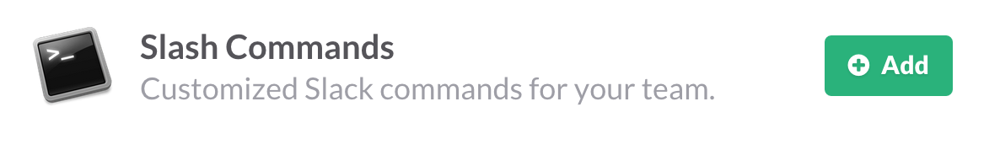

# Custom Slash Command Tutorial

Slack's custom slash commands perform a very simple task: they take whatever text you enter after the command itself (along with some other predefined values), send it to a URL, then accept whatever the script returns and posts it as a Slackbot message to the person who issued the command. What you do with that text at the URL is what makes slash commands so useful. 

For example, you have a script that translates English to French, so you create a slash command called `/translate`, and expect that the user will enter an English word that they'd like translated into French. When the user types `/translate dog` into the Slack message field, Slack bundles up the text string `dog` with those other server variables and sends the whole thing to your script, which performs its task of finding the correct French word, `chien`, and sends it back to Slack along with whatever message you added with your script has, and Slack posts it back to the user as `The French word for "dog" is "chien"`. No one else on the team will see message, since it's from Slackbot to the user.

<!-- screenshots should be 714 pixels wide -->

This very simple demo will take you through the process of setting up a custom slash command (https://api.slack.com/slash-commands) using a third-party service. It's also the first part of a larger tutorial that will show you how to use a slash command to query a remote service and post the results to a channel, group, or DM.

For part one, we'll be using [itisiup.org](http://isitup.org) to check whether a website is running. It's a handy service to use for this tutorial/demo because the [API is super simple](https://isitup.org/api/api.html), and because you don't need an API key to use the service. All you need to do is identify your script with a user agent string (which we'll cover in a bit).

## The script

Our script is going to

* Take the values that the slash command sends and turn them into variables 
* Use cURL to send the domain name to isitup.org's API
* Accept the results returned by isitup and decide what to do with them.
* Format the results into a proper JSON payload for the incoming webhook
* Return the results to the person who used the slash command

## What we'll be using

* 	PHP (http://php.net)
* 	JSON (JavaScript Object Notation - http://json.org/)

	JSON is a simple way to represent data and it's 

* 	cURL (http://curl.haxxe.se)

	If you're familiar with cURL, feel free to jump over this section.

	cURL (http://curl.haxx.se) is an open source tool that lets you transfer data with URL syntax, which is what web browsers use, and as a result, much of the web uses. Being able to transfer data with URL syntax is what makes webhooks work. The thing about cURL that's useful for us is that not only can you use it from the command line (which makes it easy to use for testing things), but you can interact with it from most modern scripting language. 

	PHP has had support for cURL for years, and we're going to take advantage of that so that our script can receive data from Slack and then send it back in. We'll be using a few very basic commands that are common for this type of task. All of the cURL that we use in this script will be transferrable to any other webhook script that you want to write. 

Don't worry too much if you've never used one or more of those. Our use of them will be thoroughly explained in the tutorial.

### cURL, briefly

## What you'll need:

* A plain text editor. If you want a free one, I recommend TextWrangler for Mac (http://barebones.com/products/textwrangler/) or Notepad++ for Windows (http://notepad-plus-plus.org/)
* A hosting account running PHP 5 and cURL where you can put the script we're going to write. Pretty much any shared hosting account in the world should work for this.
* A Slack account (a free one is fine)
* A custom slash command on Slack
* An internal webhook on Slack

## Set up your slash command

Go to your integrations page at Slack (http://my.slack.com/services/new) and scroll down to the bottom section, "DIY Integrations & Customizations". Click on the "Add" button for "Slash Commands".



Create the text command itself. This is the text that the user will type after the slash. In this case, `isitup` is clear and short, so let's stick with that. But you can use whatever makes the most sense for your command and your users.


For now you can leave everything else empty. We'll come back and finish setting this up in a bit. Just scroll down to the bottom and click the "Save Integration" button.

## The PHP script

Now we're going to go step by step through the PHP script. If PHP isn't your jam, this should still be pretty simple to apply to the language of your choice. 

### Set up your user agent string

The isitup API requests that the client is identified by a User-Agent string. This allows the isitup folks to look through their logs and see how often our script is being used on their site. Feel free to leave this set to this, or you can update it with any info you want.

    $user_agent = "IsitupForSlack/1.0 (https://github.com/mccreath/istiupforslack; mccreath@gmail.org)";

### Now for the action

The first thing you need to do when the script is called by your slash command is grab some values the command sends over and make variables out of them. It's not strictly necessary to make new variables out of these, but it's a good habit to get into, because they're easier to reuse, and you can name them what you want.

First, the command string itself. In our case, `isitup`

    $command = $_POST['command'];
    
Next, the text that was entered with the command. In this case, it will be the domain, which is what we'll send to isitup.
     
    $domain = $_POST['text'];
    
The token is an additional identifier that's sent with the slash command that you could use to verify that what's calling your script is actually your slash command. You'll find the token on your slash command configuration page.

```php
$token = $_POST['token'];
```

This `if` statement will return a message to your user if the token doesn't match, saying it needs to be updated.

```php
#
# replace this token with the token from your slash command configuration page
#

if($token != 'vnLfaOlI7natbpU5tKQBm5dQ'){ 
	$msg = "The token for the slash command doesn't match. Check your script.";
	die($msg);
	echo $msg;
}
```
    
    
The way isitup works is that you call a URL that specifies the domain you want to check and the format that you want to receive the data in. You can get JSON, JSONP, or comma-separate text. We're going to use JSON because PHP has some nice built-in tools for handling JSON. It's also a very common format for exchanging data between web services.

The URL is formatted as `https://isitup.org/[DOMAIN TO SEARCH].[DATA FORMAT]`. So if we wanted to check on Amazon and get the results in JSON, the URL would be `https://isitup.org/amazon.com.json`. If we wanted to check the Whitehouse website and get the results as comma-separated values, it would be `https://isitup.org/whitehouse.gov.csv`. Simple!
    
We're going to take the text exactly as it's typed by the user, and rely on isitup to check the validity of the domain. If it's not a valid domain, isitup.org will respond with a `3`. We want to get the JSON version back.

    $url_to_check = "https://isitup.org/".$domain.".json";

Okay, we've got all our information. Now we need to send the URL to isitup.org. 

First, we initialize cURL and tell it what URL we want it to open. We pass in our variable `$url_to_check`.

    $ch = curl_init($url_to_check);

Next we set up some options to tell cURL how to handle the tasks associate with opening the URL.

This first one sends in the user agent string that we created up above.

    curl_setopt($ch, CURLOPT_USERAGENT, $user_agent);

The second one tells cURL we expect to get some kind of information back from the URL, and we want to get that information.

    curl_setopt($ch, CURLOPT_RETURNTRANSFER, true);
    
Now we can make the call. By assigning the call to a variable, we give cURL a place to actually store the information returned from isitup.org.

    $ch_response = curl_exec($ch);

And finally, close the cURL connection.

    curl_close($ch);

After all that, we now have a variable called `$ch_response` that contains the response from isitup.org. The response will be in a JSON string and to use that JSON string, we need to get into an array. To do that, we'll pass the string to the built-in PHP function `json_decode()`. This will turn a JSON string into an object or, if you set the second parameter to `TRUE`, into an array. Arrays are a little easier to work with, so we'll use that option. Notice that we're putting the decoded array into a variable.

    $response_array = json_decode($ch_response, true);

Now we can take our array and put together the message that we're going to send back to the user. Since there are a few possible responses from isitup.org, we'll use an `if` statement to see which response we got, then set up the message for that. 

The first thing we check is whether the 

    if($ch_response === FALSE){
    
        # isitup.org could not reach the domain entered by the user 
        $reply = $url_to_check." could not be reached.";
        
    } else {
    
    	# Run all the other tests to see which status we received.
    
    }
    
    
Now we just need to see which of the three responses we got back. `1` means the site is up. `2` means the site is not up. `3` means the person who sent the command didn't write the domain properly, which usually means they left off the `.com` (or `.net`, `.org`, etc.). We're going to use a second `if` statement to test which number we got back and set the `$reply` variable to the correct message.
    
```php
if ($response_array["status_code"] == 1){
    
		$reply = "Good news! ".$response_array["domain"]." is up!";
		
}else if ($response_array["status_code"] == 2){
	
		$reply = "Oh no! ".$response_array["domain"]." is down!";
		
}else if($response_array["status_code"] == 3){
	
		$reply  = "The domain you entered, ".$domain.", does not appear to be a valid domain. ";
		$reply .= "Please enter both the domain name AND suffix (ex: amazon.com or whitehouse.gov).";

}
```
	
### Add some visual cues

One thing that might not be obvious at this point is that our messages to the user are not very differentiated. By default, Slackbot responses are dark gray instead of black, and they're italicized. These two things help set them apart from other messages, but we can take a couple of more steps to make sure that each of our messages is easier to interpret. Slack lets you use emoji in your messages, so we'll add a different emoji to each status, then we'll bold the status of the site to make it stand out a little more, and we'll link the domain name.

To bold any text in a Slackbot message, just put a single asterisk on either side, with no spaces between the asterisks and the text. In the following sentence, "a bold phrase" will be displayed in bold type.

    Here's some text with *a bold phrase*.

To turn any URL in a Slackbot message into a link, just put an angle bracket on either side of it. Luckily for this slash command, a simple domain name is enough for Slack's servers to create a link. In the following sentence, the domain will be displayed as a link to that site.

    One of the largest online retailers is <amazon.com>.

For status `1`, the site is up, let's use the universal affirmative of "thumbs up". Then linking the domain and bolding the status would give us a string that looks like this:

    ":thumbsup: I am happy to report that *<".$response_array["domain"].">* is *up*!"
    
For status `2`, the site is down, let's use the disappointed face. Adding the link and the bold text gives us this string:

    ":disappointed: I am sorry to report that *<".$response_array["domain"].">* is *down*!"
    
For status `3`, the domain entered by the user was not valid, let's use the interrobang (!?) to indicate there's a problem. Let's also include some examples of correctly formatted domains, and go ahead and bold those, too. Notice that in this message, we're 

     ":interrobang: *".$domain."* does not appear to be a valid domain. Please enter both the domain name AND the suffix (example: *amazon.com* or *whitehouse.gov*)."
     
### Completed `if` statement
     
Now our entire `if` statement looks like this:

```php
if($ch_response === FALSE){

		# isitup.org could not reach the domain entered by the user 
		$reply = $url_to_check." could not be reached.";
		
}else{

		if ($response_array["status_code"] == 1){

			$reply = ":thumbsup: I am happy to report that *<".$response_array["domain"].">* is *up*!";

		}else if ($response_array["status_code"] == 2){

		$reply = ":disappointed: I am sorry to report that *<".$response_array["domain"].">* is *down*!";

		}else if($response_array["status_code"] == 3){

		$reply  = ":interrobang: *".$domain."* does not appear to be a valid domain. ";
		$reply .= "Please enter both the domain name AND the suffix (ex: *amazon.com* or *whitehouse.gov*).";

	}
	
}
```
     
     
### Send the formatted response back to the user

Now, after all that set up and logic and design thinking, it's finally time for the climax of the script! Letting the user know what they asked!

    echo $reply;

That's it. That's all you have to to. Just echo the `$reply` string and cURL, which has been waiting patiently this whole time while we went through our machinations, will take that reply and post it back to the user in Slack.

In the next part of the tutorial, we'll build on this part in two ways:

* Handling more complex information returned from the third-party service 
* Sending the reply to Slack through an incoming webhook, which gives you more options for formatting and allows you to send the reply to any channel for everyone on the team to see.


