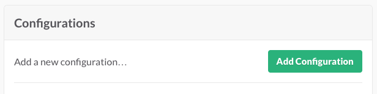
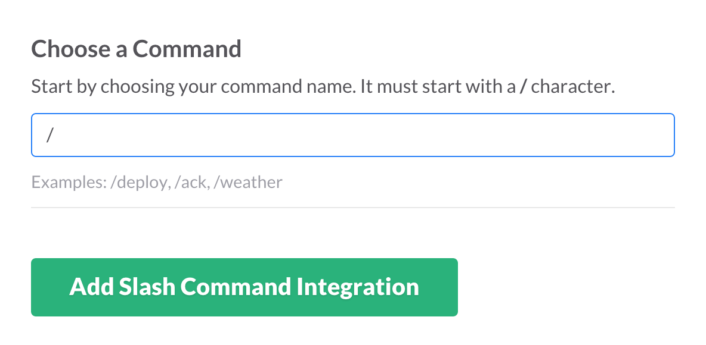
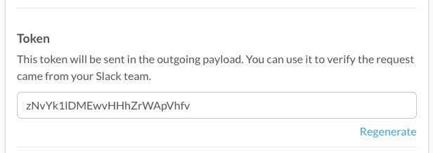
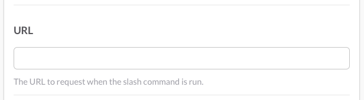
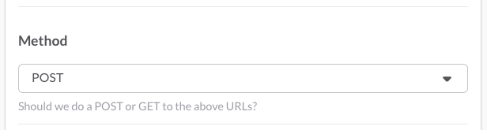
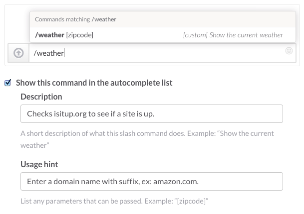

# Your First Custom Slash Command for Slack

This tutorial is the first part of a two-part series. This part will show you how to set up and process a simple slash command. The second part will work with more complex data and different message options.

You can download the completed script here: https://github.com/mccreath/isitup-for-slack/

## How Slack's Slash Commands Work

A slash command performs a very simple task: it takes whatever text you enter after the command itself and sends it to a URL. Then it receives whatever that URL returns and posts it as a message in Slack. By default this message visible only to the person who issued the command, and that’s what this tutorial will do. We’ll get into posting the message for everyone in a channel to see in the next tutorial.

**What makes slash commands so useful and powerful is what you do with that text at the URL.**

For example, you have a script that translates English to French, so you create a slash command called `/translate`, and expect that the user will enter an English word that they'd like translated into French. When the user types `/translate dog` into the Slack message field, Slack bundles up the text string `dog` with those other server variables and sends the whole thing to your script, which performs its task of finding the correct French word, `chien`, and sends it back to Slack along with whatever message you added with your script has, and Slack posts it back to the user as `The French word for "dog" is "chien"`. No one else on the team will see message, since it's from Slackbot to the user.

1.	Slack bundles up the text string dog with those other server variables and sends the whole thing to your script on your server.
2.	The script performs its task of finding the correct French word, chien
3.	The script sends it back to Slack along with whatever additional information or message you added with your script
4.	Slack posts it back to the user as The French word for “dog” is “chien”. By default, no one else on the team will see message.

This very simple demo will take you through the process of setting up a custom slash command (https://api.slack.com/slash-commands) using a third-party service. It's also the first part of a larger tutorial that will show you how to use a slash command to query a remote service and post the results to a channel, group, or DM.

If you're familiar with PHP, JSON, and cURL, you can probably find all the info you need in the comments of the `isitup.php` script in this repo. If you’re curious about the nuts and bolts, read on!

## What we're going to do

For this tutorial, we'll be using the web service [itisiup.org](http://isitup.org) to check whether a website is running. It's a good one to start with because the [API is super simple](https://isitup.org/api/api.html), and because you don't need an API key to use the service. All you need to do is identify your script to their servers.

The way isitup.org works is that you call a URL that specifies the domain you want to check and the format that you want to receive the data in. You can get JSON, JSONP, or comma-separate text. JSON stands for JavaScript Object Notation, and it's a common format for exchanging data between web services. It also happens that PHP has some nice built-in tools for working with it, so we're going to use the JSON option.

The URL is formatted as `https://isitup.org/[DOMAIN TO SEARCH].[DATA FORMAT]`. So if we wanted to check on Amazon and get the results in JSON, the URL would be `https://isitup.org/amazon.com.json`. If we wanted to check the Whitehouse website and get the results as comma-separated values, it would be `https://isitup.org/whitehouse.gov.txt`. Simple!

### What we're going to write

Our script is going to

* 	Take the values that the slash command sends and turn them into variables 
* 	Use cURL to send the domain name to isitup.org's API
* 	Accept the results returned by isitup and decide what to do with them.
* 	Format the results into a proper JSON payload for the incoming webhook
* 	Return the results to the person who used the slash command

### Tools you'll need:

*	A plain text editor. If you want a free one, I recommend TextWrangler for Mac (http://barebones.com/products/textwrangler/) or Notepad++ for Windows (http://notepad-plus-plus.org/)
*	A hosting account running PHP 5 and cURL where you can put the script we're going to write. Pretty much any shared hosting account in the world should work for this.
*	A Slack account (a free one is fine)

### What we'll be using on the server 

Don't worry too much if you've never used one or more of these. Our use of them will be thoroughly explained in the tutorial.

* 	PHP (http://php.net)

	A commonly available and widely-used server-side scripting language. 

* 	JSON (JavaScript Object Notation - http://json.org/)

	JSON is a simple way to represent and exchange data. It's an open standard format that uses human-readable text to transmit data objects consisting of key-value pairs.

* 	cURL (http://curl.haxx.se)

	cURL (http://curl.haxx.se) is an open source tool that lets you transfer data with URL syntax, which is what web browsers use, and as a result, much of the web uses. Being able to transfer data with URL syntax is what makes slash commands (and webhooks, as we'll see later) work. 

	One of the great things about cURL is that you can use it from the command line (which makes it easy to use for testing things), or you can interact with it from most modern scripting languages, including PHP. We're going to take advantage of that and use it in our script to receive data from Slack and then send it back in. We'll be using a few very basic commands that are common for this type of task. All of the cURL that we use in this script will be transferrable to any other webhook script that you want to write. 

## Set up your slash command

Go to [https://slack.com/apps/A0F82E8CA-slash-commands](https://slack.com/apps/A0F82E8CA-slash-commands) to add a new slash command (you’ll need to be signed in). Click the “Add Configuration” button to start the process.



Next, choose the text command itself. This is the text that the user will type after the slash. In this case, `isitup` is clear and short, so let's stick with that. But you can use whatever makes the most sense for your command and your users.



For now you can leave everything else empty. We'll come back and finish setting this up in a bit. Just scroll down to the bottom and click the "Save Integration" button, but don't close the page yet.

## The PHP script

Now we're going to go step by step through the PHP script. If PHP isn't your jam, this should still be pretty simple to apply to the language of your choice. Create a new file in your text editor called `isitup.php`. Save it some place where you'll be able to get to it easily when it's time to upload it.

### Set up your user agent string

The isitup API requests that the client is identified by a User-Agent string. This allows the isitup folks to look through their logs and see how often our script is being used on their site. Feel free to leave this set to this, or you can update it with any info you want.

```php
$user_agent = "IsitupForSlack/1.0 (https://github.com/mccreath/istiupforslack; mccreath@gmail.com)";
```

### Set up some variables

The first thing you need to do when the script is called by your slash command is grab some values the command sends over and make variables out of them. It's not strictly necessary to make new variables out of these, but it's a good habit to get into, because they're easier to reuse, and you can name them what you want.

All of the values can be found in a PHP array called `$_POST`, and they're all named values. To get the value of a named item in a PHP array, you use the following format: `$array_name['item_name']`. That will return the value. In the case of our slash command, if we wanted to retrieve the text of the command itself, it would look like this: `$_POST['command']`. That will have the value of `isitup`.

So following on, let's make a variable from the command string itself. In our case, `isitup`

```php
$command = $_POST['command'];
```
    
Next, the text that was entered with the command. In this case, it will be the domain, which is what we'll send to isitup.
     
```php
$domain = $_POST['text'];
```
    
The token is an additional identifier that's sent with the slash command that you could use to verify that what's calling your script is actually your slash command. You'll find the token on your slash command configuration page.

```php
$token = $_POST['token'];
```

Here's an example of an `if` statement that will return a message to your user if the token doesn’t match, saying it needs to be updated. Copy the token from your configuration page to use in your `if` statement:

  

```php
#
# replace this token with the token from your slash command configuration page
#

if($token != 'zNvYk1lDMEwvHHhZrWApVhfv'){ 
	$msg = "The token for the slash command doesn't match. Check your script.";
	die($msg);
	echo $msg;
}
```
    
We're going to take the text exactly as it's typed by the user, and rely on isitup to check the validity of the domain. If it's not a valid domain, isitup.org will respond with a `3`. We want to get the JSON version back.

```php
$url_to_check = "https://isitup.org/".$domain.".json";
```

Now that we've got all our information, we just need to send the URL to isitup.org. 

First, we initialize cURL and tell it what URL we want it to open. We pass in our variable `$url_to_check`.

```php
$ch = curl_init($url_to_check);
```

Next we set some cURL options to handle some specific tasks associated with opening the URL.

This first one sends in the user agent string that we created up above.

```php
curl_setopt($ch, CURLOPT_USERAGENT, $user_agent);
```

The second option tells cURL we expect to get some kind of information back from the URL, and we want to get that information.

```php
curl_setopt($ch, CURLOPT_RETURNTRANSFER, true);
```
    
With those in place, we can now call the URL. By assigning the call to a variable, we have a place to store the information returned from isitup.org.

```php
$ch_response = curl_exec($ch);
```

And finally, close the cURL connection.

```php
curl_close($ch);
```

We now have a variable called `$ch_response` that contains the response from isitup.org. The response will be in a JSON string, which looks something like this:

```json
{
    "domain": "duckduckgo.com",
    "port": 80,
    "status_code": 1,
    "response_ip": "46.51.197.88",
    "response_code": 200,
    "response_time": 0.025
}
```

That’s easy to read and easy to pass around the Internet, which is great. It’s why JSON exists. However, it’s easier and more efficient to work with an array than with a string so it’s a good thing that PHP has tools to convert JSON data to a PHP array. We’ll pass the string to the built-in PHP function `json_decode()`. By default this function will turn a JSON string into an object, but you can optionally turn it into an array by setting the second parameter to `TRUE`. Arrays are a little easier to work with than objects, so we’ll use that option. Notice that we’re putting the decoded array into its own variable.

```php
$response_array = json_decode($ch_response, TRUE);
```

For comparison to the JSON string, a PHP array is represented like this:

```php
array(
    "domain" => "duckduckgo.com",
    "port" => 80,
    "status_code" => 1,
    "response_ip" => "46.51.197.88",
    "response_code" => 200,
    "response_time" => 0.025
);
```

The difference a little abstract in presentation, and in practice, you won't see any of this happen. But using an array allows us to access the values that `isitup.org` sent to us using the same format that we used to set the variables from the `$_POST` array up at the top of the script, like this:

```php
$response_array['domain']
$response_array['status_code']
```

Now we can take the values from `$response_array` and put together the message that we're going to send back to the user. Since there are a few possible responses from isitup.org, we'll use an `if` statement to test which response we gotand make sure the message has the correct information. 

The first thing we check is whether the script can reach isitup.org. We do that by checking whether the `$ch_response` came back with anything. 

```php
if($ch_response === FALSE){

  # isitup.org could not be reached 
  $reply = "Ironically, isitup could not be reached.";
	
} else {

	# Run all the other tests to see which status we received.

}
```
    
Assuming that we did reach isitup.org, we need to see which of the three responses we got back. `1` means the site is up. `2` means the site is not up. `3` means the person who sent the command didn't write the domain properly, which usually means they left off the `.com` (or `.net`, `.org`, etc.). We're going to use a second `if` statement to test which number we got back and set the `$reply` variable to the correct message.
    
```php
if ($response_array['status_code'] == 1){
    
	$reply = "Good news! ".$response_array["domain"]." is up!";
		
}else if ($response_array['status_code'] == 2){
	
	$reply = "Oh no! ".$response_array["domain"]." is down!";
		
}else if($response_array['status_code'] == 3){
	
	$reply  = "The domain you entered, ".$domain.", does not appear to be a valid domain. ";
	$reply .= "Please enter both the domain name AND suffix (ex: amazon.com or whitehouse.gov).";

}
```
	
### Add some visual cues

One thing that might not be obvious at this point is that all three versions of our message will look very similar to the user. By default, Slackbot responses are dark gray instead of black, and they're italicized. These two things help set them apart from other messages, but we can take a couple of more steps to make sure that each of our messages is easier to interpret. Slack lets you use emoji in your messages, so we'll add a different emoji to each status, then we'll bold the status of the site to make it stand out a little more, and we'll link the domain name.

To bold any text in a Slackbot message, just put a single asterisk on either side, with no spaces between the asterisks and the text. In the following sentence, "a bold phrase" will be displayed in bold type.

    Here's some text with *a bold statement*.

To turn any URL in a Slackbot message into a link, just put an angle bracket on either side of it. Luckily for this slash command, a simple domain name is enough for Slack's servers to create a link. In the following sentence, the domain will be displayed as a link to that site.

    One of the largest online retailers is <http://amazon.com>.
    
But we can go one step further. Because the user only types in the domain, it makes more sense to display only the domain in the reply. We can still link it, but it takes a little more work. The format for linking text in an incoming message on Slack is `domain` + `|` (that's the pipe character) + `text`. 

    <http://domain.com/to/link/|text to link>

For our message, we're going to be linking the text of the domain itself, so the code will look a little redundant, but the output will be much nicer. We're going to do this:

    <http://".$response_array["domain"]."|".$response_array["domain"].">

For status `1`, the site is up, let's use the universal affirmative of "thumbs up". Then linking the domain and bolding the status would give us a string that looks like this:

    ":thumbsup: I am happy to report that *<".$response_array["domain"].">* is *up*!"
    
For status `2`, the site is down, let's use the disappointed face. Adding the link and the bold text gives us this string:

    ":disappointed: I am sorry to report that *<".$response_array["domain"].">* is *down*!"
    
For status `3`, the domain entered by the user was not valid, let's use the interrobang (!?) to indicate there's a problem. Let's also include some examples of correctly formatted domains, and go ahead and bold those, too. Notice that in this message, we're 

     ":interrobang: *".$domain."* does not appear to be a valid domain. Please enter both the domain name AND the suffix (example: *amazon.com* or *whitehouse.gov*)."
     
### Completed `if` statement
     
Now our entire `if` statement looks like this:

```php
if($ch_response === FALSE){

  # isitup.org could not be reached 
  $reply = "Ironically, isitup could not be reached.";
		
}else{

	if ($response_array['status_code'] == 1){

		$reply = ":thumbsup: I am happy to report that *<http://".$response_array["domain"]."|".$response_array["domain"].">* is *up*!";

	}else if ($response_array['status_code'] == 2){

		$reply = ":disappointed: I am sorry to report that *<http://".$response_array["domain"]."|".$response_array["domain"].">* is *down*!";

	}else if($response_array['status_code'] == 3){

		$reply  = ":interrobang: *".$domain."* does not appear to be a valid domain. ";
		$reply .= "Please enter both the domain name AND the suffix (ex: *amazon.com* or *whitehouse.gov*).";

	}
	
}
```
     
     
### Send the formatted response back to the user

Now, after all that set up and logic and design thinking, it's finally time for the climax of the script! Letting the user know what they asked!

```php
echo $reply;
```
That's it. That's all you have to to. Just echo the `$reply` string and cURL, which has been waiting patiently this whole time while we went through our machinations, will take that reply and post it back to the user in Slack.

*Status code `1`: The site is up.*  


*Status code `2`: The site is down.*


*Status code `3`: The domain is invalid.*


### Upload the script to your server

If you haven't already put your script on your hosting account server, now is the time to do that. I like to keep scripts like this in their own folders, but use whatever organization works for you. The important thing is to make note of what the URL is for the script for the configuration page.

So if your web address is `http://superhype.com/` and you put your script in a directory called `isitup`, the URL would be `http://superhype.com/isitup/isitup.php`.


## Finish configuring the integration

The last thing to do is take care is finalizing the slash command configuration on Slack.

Back on your configuration page, enter the **URL** where you've posted your PHP script.



Leave **Method** set to POST.



Next you need to decide whether you want to include your slash command in the auto-complete list of slash commands. This is handy if you think your command will be used frequently. Enter a description of the slash command along with some example usage.



Finally, add a descriptive label to help distinguish this slash command from the others in your team's list of configured integrations.


Save it! Now your slash command is available to your team for use.


## Next steps

In the next tutorial, we'll build on this one in two ways:

*	We’ll work with more complex information returned from the third-party service.
*	We’ll explore sending the response to Slack as a public slash command reply or through an incoming webhook, which gives you more options for formatting and allows you to send the reply to any channel for everyone on the team to see.

### Further reading

This tutorial touched several topics, and there's a lot more to learn about all of them.

*	Message formatting on Slack: https://api.slack.com/docs/formatting
*	cURL Basics: http://httpkit.com/resources/HTTP-from-the-Command-Line/
*	PHP Arrays: http://www.w3schools.com/php/php_arrays.asp
*	Using JSON: http://www.copterlabs.com/blog/json-what-it-is-how-it-works-how-to-use-it/

## Download This Project

If you haven't downloaded the completed script yet, you can get it here: https://github.com/mccreath/isitup-for-slack/

If PHP is not your thing, and you’d like to see this in Python, my colleague Jake has you covered: https://github.com/jake-swanson/isituppy


